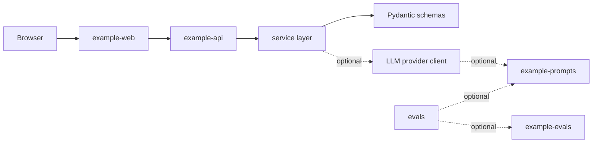

# Architecture

This boilerplate keeps a small but production-shaped monorepo structure: a FastAPI service, a SvelteKit static demo, optional prompt/eval packages, and Terraform infrastructure.

## Apps

`apps/example-api` is the backend. Routes stay thin, schemas define API contracts, services contain application behavior, and clients isolate optional provider integrations.

`apps/example-web` is a static SvelteKit demo. It keeps fetch calls in `src/lib/api.ts`, shared browser types in `src/lib/types.ts`, and observable browser events in `src/lib/logger.ts`.

## Default API Flow

The default demo is intentionally deterministic:

1. `GET /` returns service metadata.
2. `GET /health` returns operational health and build version.
3. `GET /sample-resource` calls the sample service and returns a structured response.

## Optional AI Flow

AI support is scaffolded but disabled by default. Projects that need it can enable `LLM_PROVIDER=openai`, install the API with the `llm` extra, and replace the example prompt/eval assets with domain-specific behavior.
